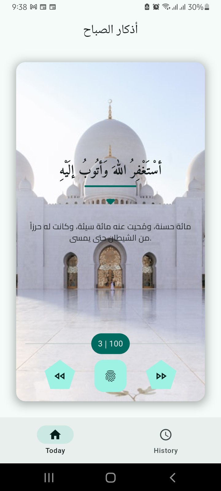

# آذکار الصباح (Morning Azkar)

A beautiful and simple Flutter application for reading and tracking morning Azkar (Islamic supplications).

## 📱 App Features

- **Daily Morning Azkar**: Access authentic morning supplications
- **Counter System**: Track your Azkar repetitions with easy-to-use counters
- **Progress Tracking**: Monitor your daily progress
- **History View**: Review your previous Azkar sessions
- **Clean UI**: Simple and intuitive user interface
- **Offline Access**: Use the app without internet connection

## 🖼️ Screenshots

### Main Screen



*The main screen displays the morning Azkar with counter functionality*

### Features Display
- **Azkar Text**: Clear Arabic text of the supplication
- **Counter**: Tap to increment your repetition count (0/100)
- **Progress Tracking**: Visual progress indicator
- **Daily Stats**: Today's progress and history overview

## 🚀 Installation

### Prerequisites
- Flutter SDK (version 3.0 or higher)
- Dart SDK (version 2.17 or higher)
- Android Studio/VSCode with Flutter extension

##Clone the repository:
```bash
git clone https://github.com/abdumic/flutter-azkar-app.git
```
